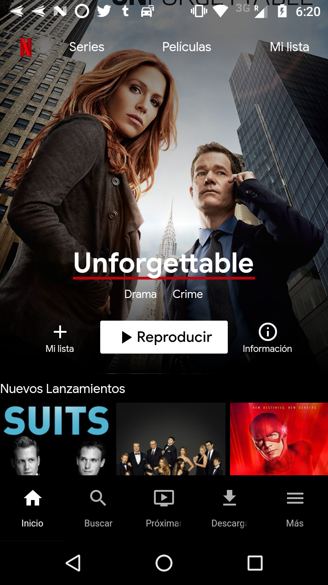
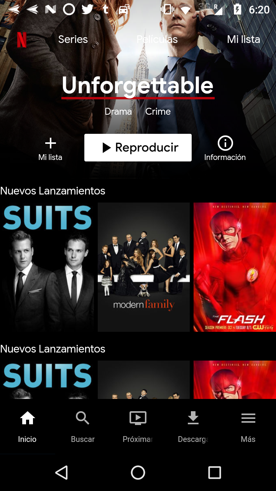
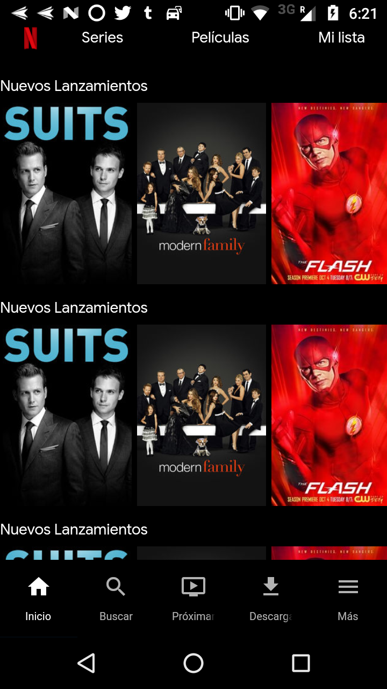
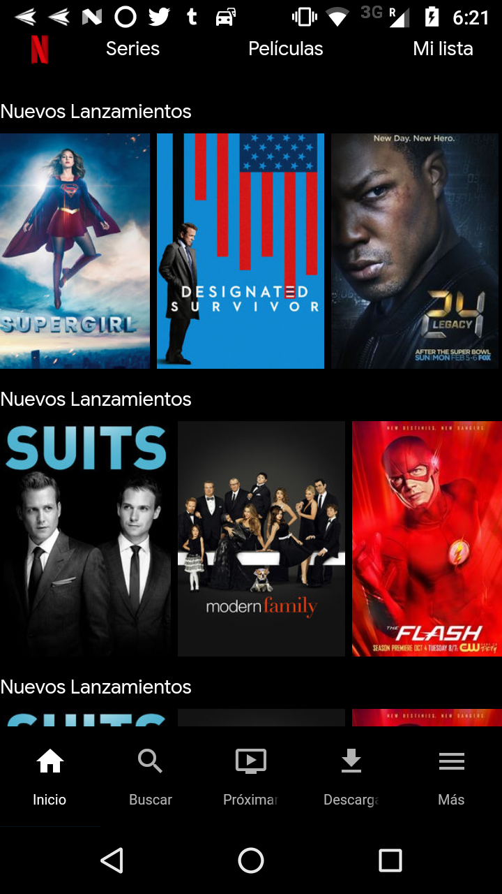
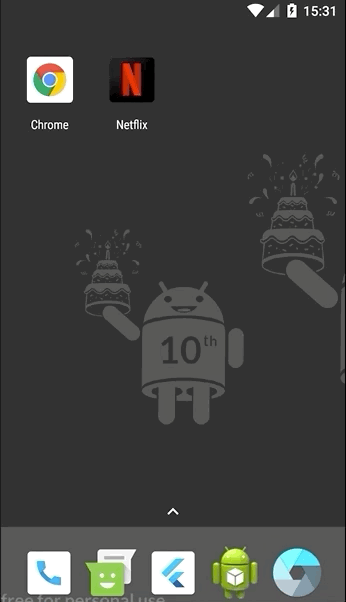

# Flutter Netflix Clone

Flutter App with the same style as Netflix for Android and iOS.

## Server

[Netflix Flutter NodeJS & MongoDB](https://github.com/devdennysegura/nodejs-server-Flutter-Netflix-App)

## Installation

    $ clone this repo
    $ Install flutter dependencies
    $ Install Netflix NodeJS & MongoDB
    $ Run NodeJS
    $ Change host String on `src/resources/movie_api_provider.dart`
    $ flutter run

Thanks
------

**Denny Segura** © 2018+, Released under the [MIT License]. 

> GitHub [@devdennysegura](https://github.com/devdennysegura) &nbsp;&middot;&nbsp;
> Twitter [@dennysegura3](https://twitter.com/dennysegura3)

[MIT License]: http://mit-license.org/